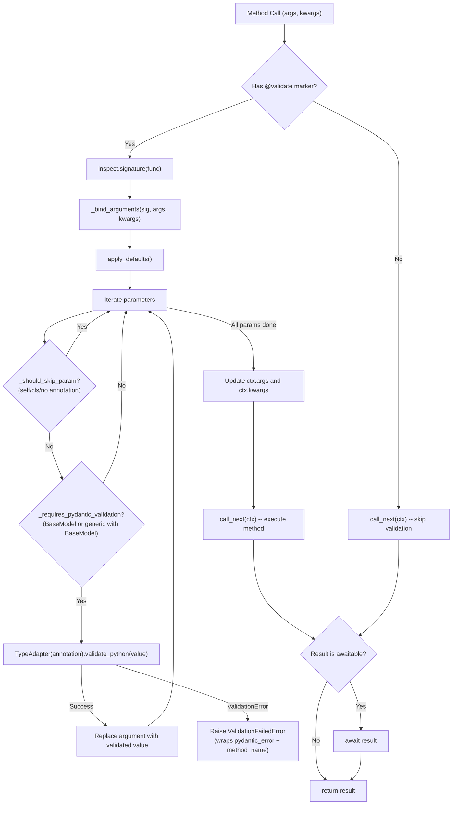
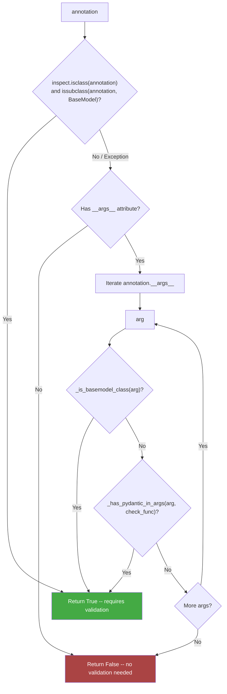

# Architecture Overview — pico-pydantic

`pico-pydantic` is an integration layer that enforces **Runtime Type Safety** within the **Pico-IoC** container using **Pydantic** models.

It implements an **AOP (Aspect-Oriented Programming)** pattern to:

1.  **Intercept** method calls to IoC components.
2.  **Validate** arguments against Pydantic schemas before the method executes.
3.  **Decouple** validation logic from business logic.

Its purpose is to turn Python type hints into **enforced contracts**.

---

## 1. High-Level Design

The library acts as a **Guard Layer** sitting between the caller and your service components.

```
                        ┌───────────────────────────┐
                        │      Caller / Client      │
                        │ (Controller, Test, etc.)  │
                        └─────────────┬─────────────┘
                                      │
                             (Calls Component)
                                      │
                                      ▼
┌───────────────────────────────────────────────────────────────────────┐
│                           Pico-IoC Container                          │
│                                                                       │
│   ┌───────────────────────────┐       ┌───────────────────────────┐   │
│   │   ValidationInterceptor   │       │      Target Service       │   │
│   │       (Singleton)         │       │    (Singleton/Proto)      │   │
│   └─────────────┬─────────────┘       └─────────────┬─────────────┘   │
│                 │                                   │                 │
│      (Intercepts & Inspects)                (Executes Logic)          │
│                 │                                   │                 │
│        ┌────────▼────────┐                          │                 │
│        │    Pydantic     │◄─────────────────────────┘                 │
│        │ (Schema Check)  │       (Only if Valid)                      │
│        └─────────────────┘                                            │
└───────────────────────────────────────────────────────────────────────┘
```

---

## 2. Architectural Comparison

This section contrasts the standard Python approach with the `pico-pydantic` design.

| Aspect | Standard Python / Manual | `pico-pydantic` Architecture |
| :--- | :--- | :--- |
| **Type Safety** | **Advisory.** Type hints are documentation. You can pass a `str` to an `int` argument, and Python won't complain until it crashes inside the method. | **Enforced.** Type hints are contracts. If you pass the wrong type or invalid data, execution is blocked *before* entering the method. |
| **Validation Logic** | **Coupled & Repetitive.** Methods are cluttered with manual `if` checks, `isinstance` calls, or explicit `Model.model_validate(data)` calls. | **Transparent & Decoupled.** Validation is handled by an **Interceptor**. The service code remains pure business logic, unaware of the validation mechanism. |
| **Error Handling** | **Inconsistent.** Different methods might raise `ValueError`, `TypeError`, or custom exceptions depending on how the developer wrote the check. | **Standardized.** All validation failures raise a uniform `ValidationFailedError`, wrapping the underlying Pydantic `ValidationError`. |
| **Configuration** | **Imperative.** You write validation code inside the function body. | **Declarative.** You simply decorate the method with `@validate` and use standard type hints. |
| **Performance** | **Variable.** Depends on the efficiency of manual checks. | **Optimized.** The interceptor uses metadata marking (`VALIDATE_META`) to skip non-validated methods instantly, minimizing overhead. |

---

## 3. Execution Flow

This flow describes what happens when a method decorated with `@validate` is called.

```

Method Call (args, kwargs)
│
▼
┌──────────────────────────────────────────────┐
│ [ValidationInterceptor]                      │
│ 1. Intercepts the call via pico-ioc hook     │
│ 2. Checks for `@validate` marker             │
│ 3. REFLECTION: Inspects function signature   │
└──────────────────────┬───────────────────────┘
│
▼
┌──────────────────────────────────────────────┐
│ [Argument Binding Strategy]                  │
│ 1. Detects `self` (Instance vs Class method) │
│ 2. Maps `args` & `kwargs` to param names     │
│ 3. Applies default values                    │
└──────────────────────┬───────────────────────┘
│
▼
┌──────────────────────────────────────────────┐
│ [Pydantic Bridge]                            │
│ FOR EACH parameter IN signature:             │
│   IF type\_hint is Pydantic Model:            │
│      try:                                    │
│         TypeAdapter.validate\_python(value)   │
│      except ValidationError:                 │
│         RAISE ValidationFailedError          │
└──────────────────────┬───────────────────────┘
│ (All Valid)
▼
┌──────────────────────────────────────────────┐
│ [Target Component]                           │
│ Executes original method logic               │
│ return result                                │
└──────────────────────────────────────────────┘

```

### Validation Interceptor Flow (Mermaid)



### Type Resolution Tree (Mermaid)



**Examples of type resolution:**

| Annotation               | Resolution Path                                                |
|:-------------------------|:---------------------------------------------------------------|
| `UserModel`              | `isclass` + `issubclass(BaseModel)` -- True                   |
| `List[UserModel]`        | Not a class -- check `__args__` -- `(UserModel,)` -- True     |
| `Optional[UserModel]`    | `Union[UserModel, None]` -- `__args__` -- `(UserModel, None)` -- True |
| `Union[str, int]`        | `__args__` -- `(str, int)` -- neither is BaseModel -- False   |
| `str`                    | Not BaseModel, no `__args__` -- False                         |

---

## 4. The Decorator Model (`@validate`)

The `@validate` decorator is lightweight. It does **not** contain validation logic. It serves as a **Marker**.

* **Role**: Metadata Tagging.
* **Behavior**: Sets a hidden attribute `_pico_pydantic_validate_meta = True` on the function.
* **Reasoning**: Keeping the decorator logic-free ensures that import times remain fast and allows the Interceptor (which has access to the full IoC context) to handle the heavy lifting.

```python
from pico_pydantic import validate

class UserService:
    # The decorator just says: "Hey Interceptor, look at me!"
    @validate 
    def create_user(self, user: UserSchema):
        # By the time we get here, 'user' is GUARANTEED 
        # to be a valid UserSchema instance.
        pass
```

-----

## 5\. The Interceptor Model

The `ValidationInterceptor` is a `MethodInterceptor` component managed by Pico-IoC.

  * **Scope**: `singleton` (Created once, handles all calls).
  * **Reflection**: It uses `inspect.signature` to understand what arguments the method expects.
  * **Heuristics**: It includes logic to handle the discrepancy between how `pico-ioc` passes arguments (where `self` might be explicit) and how Python binds them.

**Key Logic:**
It specifically looks for subclasses of `pydantic.BaseModel`. Standard types (`int`, `str`) are currently passed through without Pydantic validation to avoid excessive overhead, assuming Python's runtime handles basic primitives efficiently enough or Pydantic models are the primary concern for complex data.

-----

## 6\. Architectural Intent

**`pico-pydantic` exists to:**

  * Promote **Defensive Programming** at the boundaries of your components.
  * Eliminate "Boilerplate Validation Code" from your services.
  * Ensure that if a Service receives a Data Transfer Object (DTO), it is **valid**, **complete**, and **safe**.

It does *not* attempt to:

  * Replace Pydantic.
  * Validate return values (currently focused on Inputs).
  * Validate standard primitives (like `int` ranges) outside of a Pydantic Model context.

-----

## 7\. When to Use

Use **pico-pydantic** if your application needs:

**Strict Contracts:** You want to guarantee that a `User` object passed to `UserService` is valid.
**Clean Services:** You want to remove `.model_validate()` or `try/except ValidationError` blocks from your business logic.
**Fail-Fast Behavior:** You want execution to stop *before* the method body is entered if data is invalid.
**IoC Integration:** You are already using `pico-ioc` and want validation to feel native to the container.

Avoid pico-pydantic if:

You are validating simple primitives (e.g., just an `int > 0`) without a Pydantic model (use standard `assert` or simple checks).
You need extremely high-performance loops (reflection adds a small overhead per call).
You are not using Pydantic models for your data structures.

-----

## 8\. Summary

`pico-pydantic` is a **Quality Assurance layer**:

It allows you to trust your method arguments.

> The Decorator marks the contract.
> The Interceptor enforces the contract.
> The Service executes the contract.


## Stability and versioning

This module follows the ecosystem policy in [ADR-014: API Stability and Deprecation](https://github.com/dperezcabrera/pico-ioc/blob/main/docs/adr/adr-0014-api-stability-and-deprecation.md). The public API is exactly what `__all__` exports, pinned by `tests/test_exports.py`. Before 1.0 a breaking change ships as a minor release; a deprecated name keeps working, with a `DeprecationWarning` naming its replacement, for at least one minor release and 90 days before removal.
